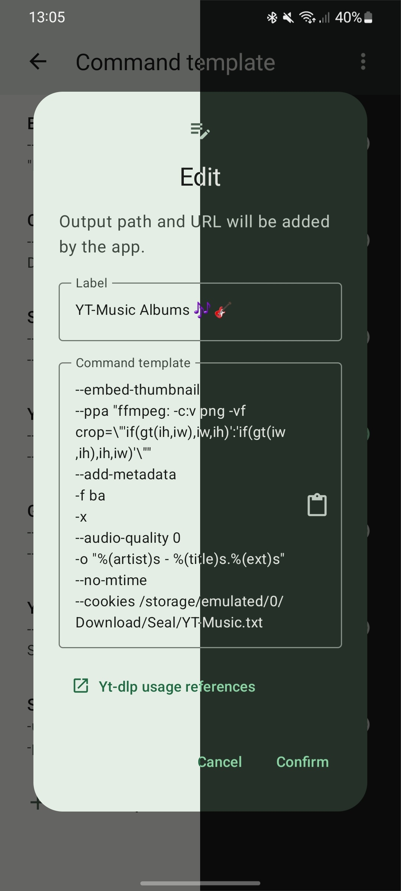

 
	

<h1 align="center">
Seal
</h1>

  <a href="https://github.com/JunkFood02/Seal/blob/main/README.md">English</a>
&nbsp;&nbsp;| &nbsp;&nbsp;
<a href="https://github.com/JunkFood02/Seal/blob/main/README-zh.md">简体中文</a>
&nbsp;&nbsp;| &nbsp;&nbsp;
<a href="https://github.com/JunkFood02/Seal/blob/main/README-ar.md">العربية</a>
&nbsp;&nbsp;| &nbsp;&nbsp;
<a href="https://github.com/JunkFood02/Seal/blob/main/README-pt.md">Portuguese</a>
&nbsp;&nbsp;| &nbsp;&nbsp;
<a href="https://github.com/JunkFood02/Seal/blob/main/README-ua.md">Українська</a>
&nbsp;&nbsp;| &nbsp;&nbsp;
<a href="https://github.com/JunkFood02/Seal/blob/main/README-th.md">ภาษาไทย</a>
  &nbsp;&nbsp;| &nbsp;&nbsp;
فارسی

## 📱 اسکرین شات ها

 
  
## 📖 امکانات

  

- دانلود ویدیو و صدا های پشتیبانی شده توسط [yt-dlp](https://github.com/yt-dlp/yt-dlp)

- چسباندن فراداده و تصویر بندانگشتی ویدیو را در فایل های صوتی که توسط [mutagen](https://github.com/quodlibet/mutagen). پشتیبانی می شود 

- دانلود تمامی ویدیو های یک لیست پخش فقط با یک کلیک

- قابلیت استفاده از [aria2c](https://github.com/aria2/aria2) برای دانلود 

- چسباندن زیرنویس ها به فیلم های دانلودی

- اجرای دستورات سفارشی yt-dlp به وسیله الگو ها

- امکان مدیریت دانلود های درون برنامه ای و الگو های سفارشی دستورات

- سادگی در استفاده و کاربرپسند

- [طراحی رابط کاربری [Material Design 3](https://m3.material.io/) با رنگ پویا

- ظاهر برنامه و شرط ها با زبان کاتلین نوشته شده است

## ⬇️ دانلود 

برای اکثر دستگاه ها پیشنهاد می شود نسخه **arm64-v8a** را دانلود کنید.

-دانلود آخرین نسخه برنامه [GitHub releases](https://github.com/JunkFood02/Seal/releases/latest)

-[نسخه آزمایشی](https://github.com/JunkFood02/Seal/releases/) را جهت تست و کمک به ما در توسعه دانلود کنید

- دانلود آخرین نسخه از F-Droid :

     
## 💬 تماس با ما

جهت گفتگو و با خبر شدن از آخرین بروزرسانی به کانال ما در تلگرام به [@seal_app](https://t.me/seal_app) و در فضای ماتریکس به آدرس [Matrix Space](https://matrix.to/#/#seal-space:matrix.org) بپیوندید

## 🤝 همکاری

علاقه مند به کمک به ما هستید ؟ برای کمک در ترجمه برنامه می توانید به [Hosted Weblate](https://hosted.weblate.org/projects/seal/) مراجعه کنید و مارا در ترجمه برنامه یاری کنید

>**نکته**

جهت ارسال هرگونه گزارش مشکل, سوالات, ایده ها و کمک در توسعه برنامه ابتدا دستورالعمل را به آدرس [CONTRIBUTING.md](https://github.com/JunkFood02/Seal/blob/main/CONTRIBUTING.md) مطالعه کنید

## ⭐️تاریخچه امتیاز

<a href="https://star-history.com/#JunkFood02/Seal&Timeline">

	
## 🧱 منابع

برنامه Seal یک نسخه گرافیکی از [yt-dlp](https://github.com/yt-dlp/yt-dlp) می باشد و بر پایه [youtubedl-android](https://github.com/yausername/youtubedl-android) توسعه داده شده است

برخی از کد های برنامه از [Read You](https://github.com/Ashinch/ReadYou) و [Music You](https://github.com/Kyant0/MusicYou) قرض گرفته شده است

<a href="https://github.com/yausername/dvd">dvd</a>

<a href="https://github.com/material-foundation/material-color-utilities">Material color utilities</a>

<a href="https://github.com/Kyant0/Monet">Monet</a>

## 📃 لایسنس

<table><td>
<a href="#start-of-content">رفتن به بالا</a>
</td></table>

