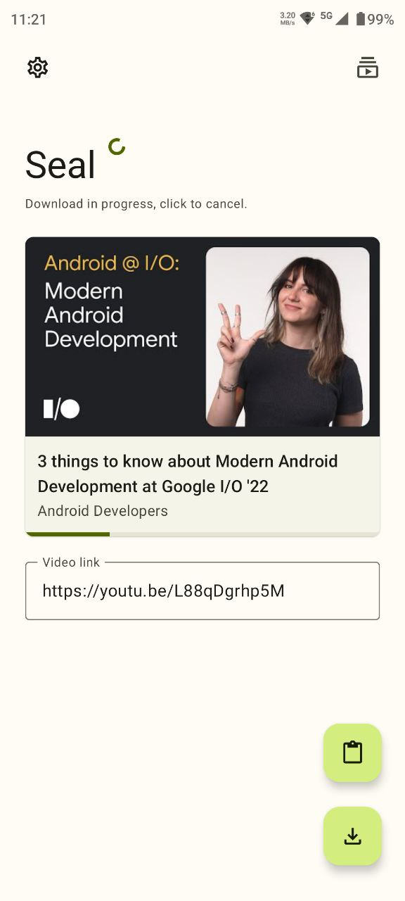
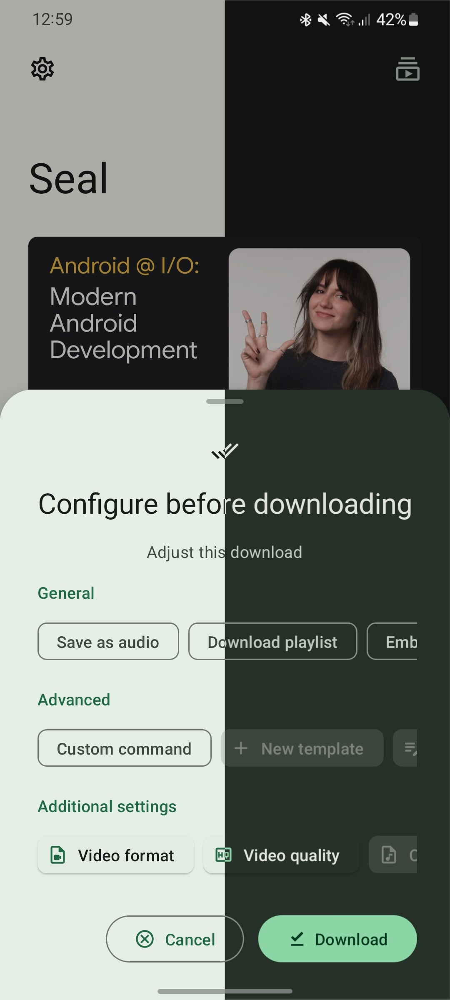
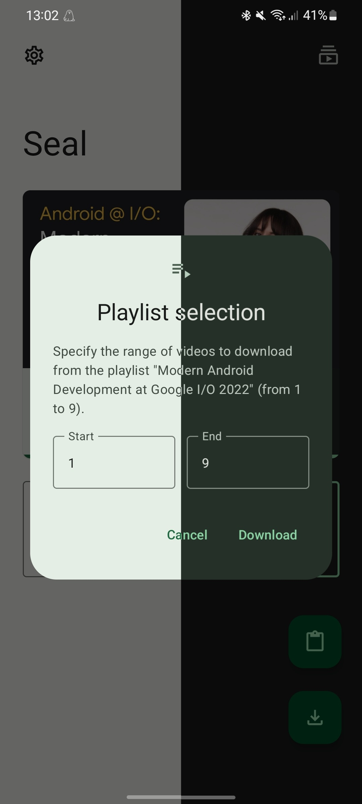
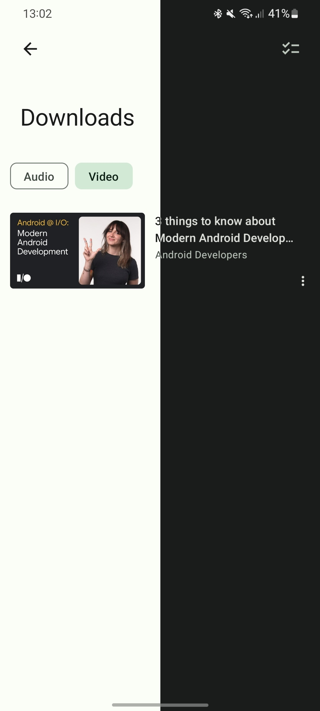
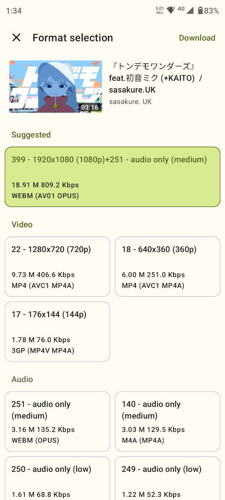
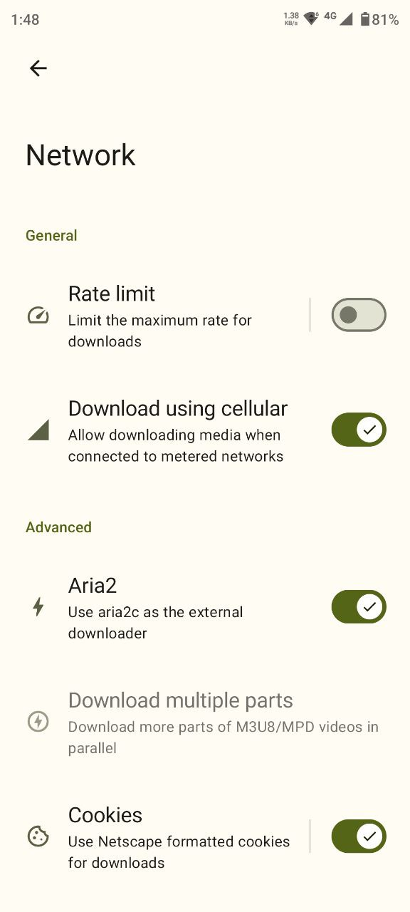
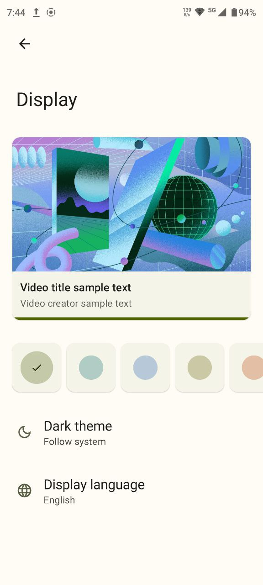
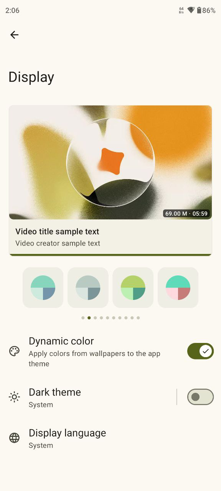
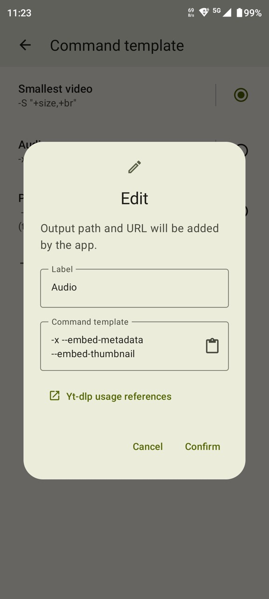

	

# Seal

### Video/Audio Downloader per Android

  <a href="https://github.com/JunkFood02/Seal/blob/main/README.md">English</a>
&nbsp;&nbsp;| &nbsp;&nbsp;
<a href="https://github.com/JunkFood02/Seal/blob/main/README-zh.md">简体中文</a>
&nbsp;&nbsp;| &nbsp;&nbsp;
<a href="https://github.com/JunkFood02/Seal/blob/main/README-ar.md">العربية</a>
&nbsp;&nbsp;| &nbsp;&nbsp;
<a href="https://github.com/JunkFood02/Seal/blob/main/README-pt.md">Portuguese</a>
&nbsp;&nbsp;| &nbsp;&nbsp;
<a href="https://github.com/JunkFood02/Seal/blob/main/README-ua.md">Українська</a>
&nbsp;&nbsp;| &nbsp;&nbsp;
<a href="https://github.com/JunkFood02/Seal/blob/main/README-fa.md">فارسی</a>
&nbsp;&nbsp;| &nbsp;&nbsp;
Italiano

## 📱 Screenshots

 

## 📖 Funzionalità

- Scarica video e audio da tutte le piattaforme supportate da [yt-dlp](https://github.com/yt-dlp/yt-dlp) (conosciuto precedentemente come youtube-dl).

- Integra i metadati e le anteprime degli audio attraverso [mutagen](https://github.com/quodlibet/mutagen).

- Scarica tutti i video in una playlist con un solo click.

- Usa [aria2c](https://github.com/aria2/aria2) integrato per tutti i tuoi download esterni.

- Integra i sottotitoli nel video scaricato.

- Esegui comandi di yt-dlp personalizzati.

- Gestisci i download in-app e i template di comandi personalizzati.

- Facile da usare.

- UI a tema dinamico [Material Design 3](https://m3.material.io/).

- MAD: UI e logica scritti interamente in Kotlin. Attività singola, niente frammentazioni, solo destinazioni componibili.

## ⬇️ Download

Per la maggior parte dei dispositivi, é consigliato installare la versione **arm64-v8a** dell'apk.

- Scarica l'ultima versione stabile dalle [release di GitHub](https://github.com/JunkFood02/Seal/releases/latest)
  - Installa la versione [pre-release](https://github.com/JunkFood02/Seal/releases/) per aiutarci a testare nuove funzionalità e trovare bug.

- Le versioni stabili sono disponibili anche su [F-Droid](https://f-droid.org/packages/com.junkfood.seal/)

<!--  -->

## 💬 Contatti

Entra nel nostro [Canale Telegram](https://t.me/seal_app) o nel nostro [spazio Matrix](https://matrix.to/#/#seal-space:matrix.org) per discussioni, annunci e molto altro!

## 💖 Sponsor

<!-- sponsors --><!-- sponsors -->

Seal rimarra sempre gratis e open-source per tutti. Se ti piace, considera [diventare uno sponsor](https://github.com/sponsors/JunkFood02)!

## 🤝 Contribuire

Tutte le contribuzioni sono ben accette!

Puoi aiutare a tradurre Seal su [Hosted Weblate](https://hosted.weblate.org/projects/seal/).
	

	
>**Nota Bene**
>
>Per inviare report di bug, richieste di feature, domande o qualsiasi altra idea per migliorare, perfavore leggi [CONTRIBUTING.md](https://github.com/JunkFood02/Seal/blob/main/CONTRIBUTING.md) per istruzioni e linee guida.

## ⭐️ Storia delle Stelle

## 🧱 Crediti

Seal é una semplice GUI per [yt-dlp](https://github.com/yt-dlp/yt-dlp), basata su [youtubedl-android](https://github.com/yausername/youtubedl-android)

Alcune parti del design UI sono prese da [Read You](https://github.com/Ashinch/ReadYou) e [Music You](https://github.com/Kyant0/MusicYou)

[dvd](https://github.com/yausername/dvd)

[Material color utilities](https://github.com/material-foundation/material-color-utilities)

[Monet](https://github.com/Kyant0/Monet)

## 📃 Licenza

>**Avvertimento**
>
>Eccetto per le parti di codice sotto licenza GPLv3, é proibito da parte di terzi di usare il nome di Seal come il nome per un app di download e lo stesso vale per tutti i lavori derivati di Seal.
>I derivati includono ma non sono limitati a fork del progetto o build non ufficiali.

<table><td>
<a href="#start-of-content">👆 Torna su</a>
</td></table>

