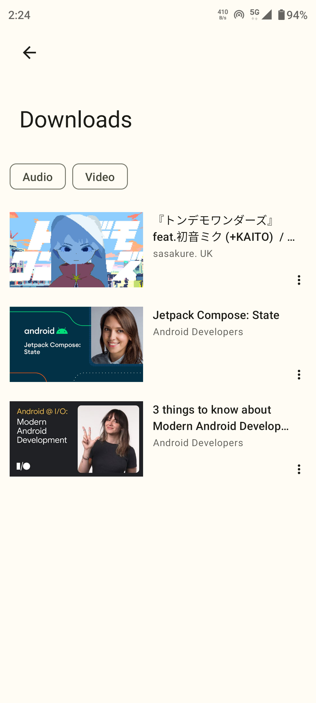
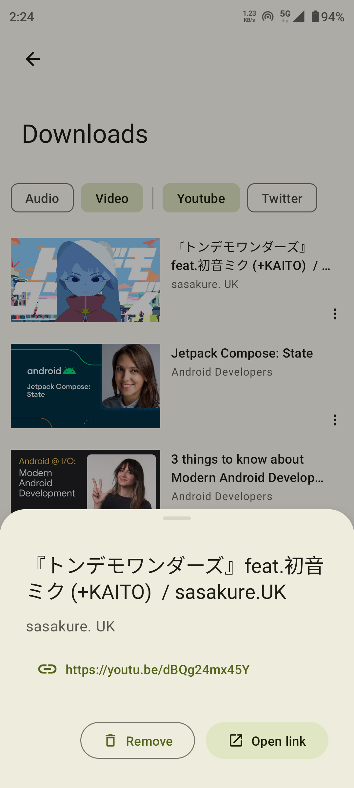

 
	

<h1 align="center">
Seal
</h1>

Завантажувач відео та аудіо для Android

<a href="https://github.com/JunkFood02/Seal/blob/main/README.md">English</a>
&nbsp;&nbsp;| &nbsp;&nbsp;
<a href="https://github.com/JunkFood02/Seal/blob/main/README-zh.md">简体中文</a>
&nbsp;&nbsp;| &nbsp;&nbsp;
<a href="https://github.com/JunkFood02/Seal/blob/main/README-ar.md">العربية</a>
&nbsp;&nbsp;| &nbsp;&nbsp;
<a href="https://github.com/JunkFood02/Seal/blob/main/README-pt.md">Portuguese</a>
&nbsp;&nbsp;| &nbsp;&nbsp;
Українська

## 📱 Скріншоти

 

## 📖 Особливості

- Завантажуйте відео та аудіо файли з сайтів, які підтримуються yt-dlp (тобто youtube-dl)

- Додавайте метадані і прев'ю у завантажені аудіо файли завдяки mutagen

- Завантажуйте усі відео з плейлиста в один клік

- Використовуйте вбудований aria2c як завантажувач для всіх своїх завантажень

- Додавайте субтитри у завантажені відео

- Використовуйте власні команди yt-dlp завдяки шаблонам

- Переглядайте та керуйте завантаженнями у застосунку

- Простий та приємний у використанні

- Стилізований під Material Design 3 інтерфейс з динамічною колірною схемою

- Круте: Інтерфейс та логіка написані на Kotlin. Один актівіті, без фрагментів, лише composable destinations.

## ⬇️ Завантажити

Або завантажте останні APK на сторінці [з релізами.](https://github.com/JunkFood02/Seal/releases/)

## 🤝 Допомога

Співпраця вітається!

Допоможіть перекласти Seal на [Hosted Weblate](https://hosted.weblate.org/projects/seal/).

>**Нотатка**  
> Щоб надіслати звіти про помилки, запити на додавання нових функцій, запитання чи будь-які інші ідеї щодо покращення, спершу прочитайте [CONTRIBUTING.md](https://github.com/JunkFood02/Seal/blob/main/CONTRIBUTING.md) за інструкціями та вказівками.

## ⭐️ Історія зірочок

## 🧱 Подяки

Seal - це простий інтерфейс для [yt-dlp](https://github.com/yt-dlp/yt-dlp), який був створений на базі [youtubedl-android](https://github.com/yausername/youtubedl-android)

Деякий код та елементи інтерфейсу взяти з [Read You](https://github.com/Ashinch/ReadYou) та [Music You](https://github.com/Kyant0/MusicYou)

[dvd](https://github.com/yausername/dvd)

[Material color utilities](https://github.com/material-foundation/material-color-utilities)

## 📃 Ліцензія

<table><td>
<a href="#start-of-content">👆 Прокрутити вгору</a>
</td></table>

