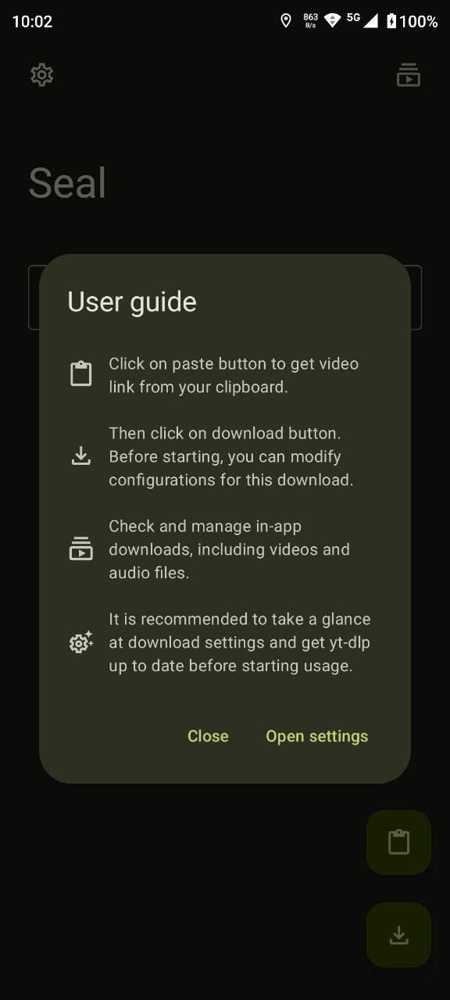
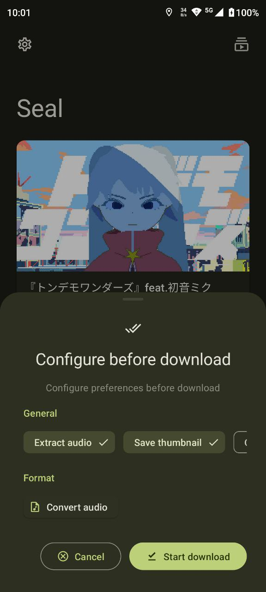
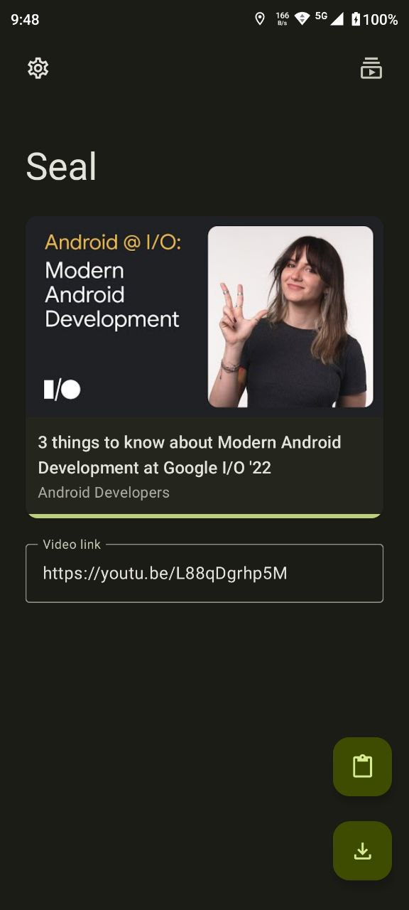
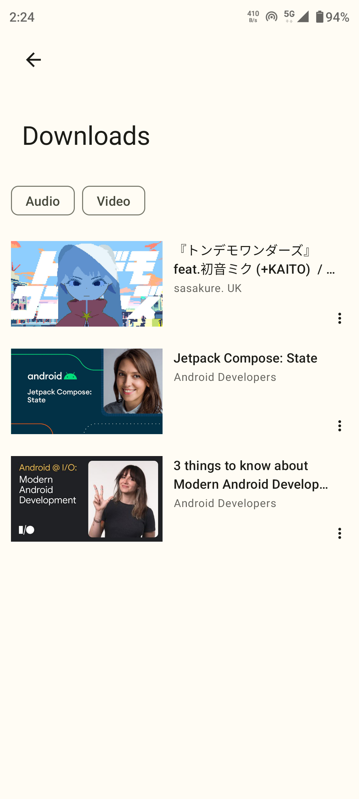
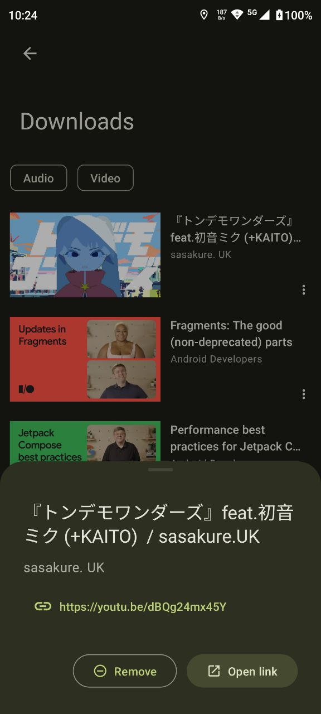

# Seal
Video/Audio Downloader for Android, written with [Jetpack Compose](https://developer.android.com/jetpack/compose).

[简体中文](https://github.com/JunkFood02/Seal/blob/main/README-zh.md)

## Screenshots

## Features

- Download videos and audio files from video platforms supported by [yt-dlp](https://github.com/yt-dlp/yt-dlp).

- Embed metadata and video thumbnail into extracted audio files supported by [mutagen](https://github.com/quodlibet/mutagen).

- Download all videos in playlist in one click

- Execute custom yt-dlp command with template.

- Manage in-app downloads.

- Easy to use and user-friendly.

- [Material Design 3](https://m3.material.io/) style UI, with [dynamic color](https://m3.material.io/foundations/customization) theme (~~is this really needed in a video downloader?~~)

- MAD: UI and logic written with pure Kotlin. Single activity, no fragments but composable destinations.

## Credits

Seal is just a simple GUI of [youtubedl-android](https://github.com/yausername/youtubedl-android) and [yt-dlp](https://github.com/yt-dlp/yt-dlp)

UI design and codes are heavily based on [Read You](https://github.com/Ashinch/ReadYou) and [Music You](https://github.com/Kyant0/MusicYou)

[dvd](https://github.com/yausername/dvd)

[Material color utilities](https://github.com/material-foundation/material-color-utilities)
