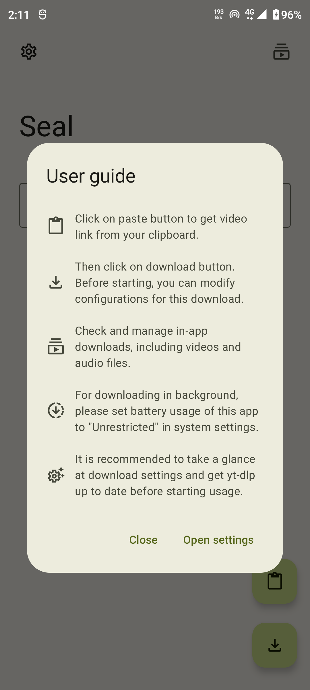
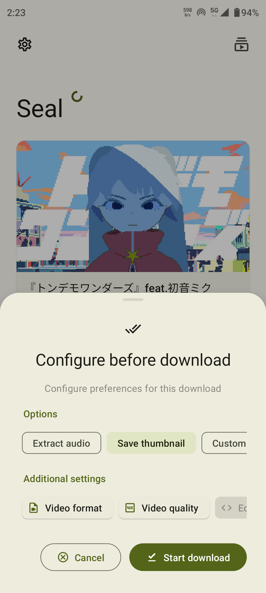
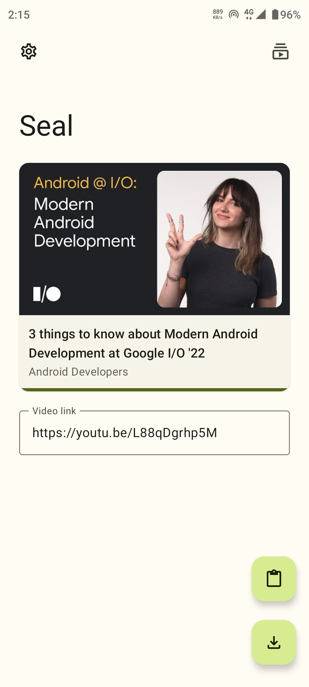
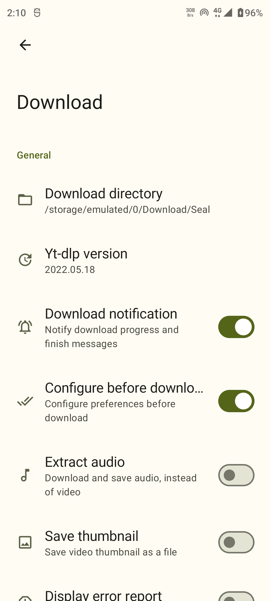

 
	

<h1 align="center">
	Seal
</h1>

	Video/Audio Downloader for Android

<a href="https://github.com/JunkFood02/Seal/blob/main/README-zh.md">简体中文</a>

## Screenshots

## Features

- Download videos and audio files from video platforms supported by [yt-dlp](https://github.com/yt-dlp/yt-dlp).

- Embed metadata and video thumbnail into extracted audio files supported by [mutagen](https://github.com/quodlibet/mutagen).

- Download all videos in the playlist with one click.

- Execute custom yt-dlp commands with a template.

- Manage in-app downloads.

- Easy to use and user-friendly.

- [Material Design 3](https://m3.material.io/) style UI, with [dynamic color](https://m3.material.io/foundations/customization) theme.

- MAD: UI and logic written with pure Kotlin. Single activity, no fragments, only composable destinations.

## Download

Download the latest apk from [releases](https://github.com/JunkFood02/Seal/releases/latest)

## Contributing

Contributions are welcome!

You can help translate Seal on [Weblate](https://hosted.weblate.org/projects/seal/).

For bug reports, feature requests, or any other ideas to improve, please [submit an issue](https://github.com/JunkFood02/Seal/issues/new).

## Credits

Seal is a simple GUI of [yt-dlp](https://github.com/yt-dlp/yt-dlp), based on [youtubedl-android](https://github.com/yausername/youtubedl-android)

Some of the UI designs and codes are borrowed from [Read You](https://github.com/Ashinch/ReadYou) and [Music You](https://github.com/Kyant0/MusicYou)

[dvd](https://github.com/yausername/dvd)

[Material color utilities](https://github.com/material-foundation/material-color-utilities)
