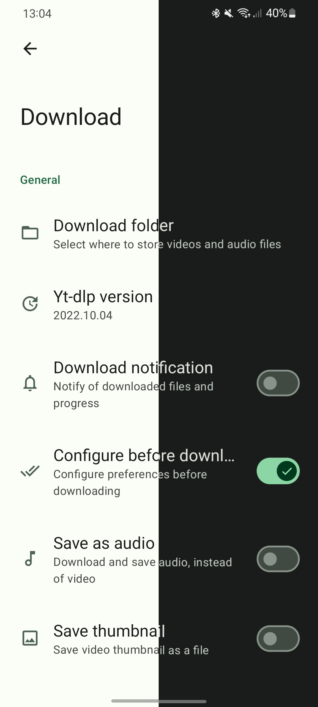

# Seal

### Video/Audio Downloader for Android

English
&nbsp;&nbsp;| &nbsp;&nbsp;
<a href="https://github.com/JunkFood02/Seal/blob/main/README-zh_Hans.md">简体中文</a>
&nbsp;&nbsp;| &nbsp;&nbsp;
<a href="https://github.com/JunkFood02/Seal/blob/main/README-zh_Hant.md">繁體中文</a>
&nbsp;&nbsp;| &nbsp;&nbsp;
<a href="https://github.com/JunkFood02/Seal/blob/main/README-ar.md">العربية</a>
&nbsp;&nbsp;| &nbsp;&nbsp;
<a href="https://github.com/JunkFood02/Seal/blob/main/README-pt.md">Portuguese</a>
&nbsp;&nbsp;| &nbsp;&nbsp;
<a href="https://github.com/JunkFood02/Seal/blob/main/README-ua.md">Українська</a>
&nbsp;&nbsp;| &nbsp;&nbsp;
<a href="https://github.com/JunkFood02/Seal/blob/main/README-th.md">ภาษาไทย</a>
&nbsp;&nbsp;| &nbsp;&nbsp;
<a href="https://github.com/JunkFood02/Seal/blob/main/README-fa.md">فارسی</a>
&nbsp;&nbsp;| &nbsp;&nbsp;
<a href="https://github.com/JunkFood02/Seal/blob/main/README-it.md">Italiano</a>
&nbsp;&nbsp;| &nbsp;&nbsp;
<a href="https://github.com/JunkFood02/Seal/blob/main/README-az.md">Azərbaycanca</a>
&nbsp;&nbsp;| &nbsp;&nbsp;
<a href="https://github.com/JunkFood02/Seal/blob/main/README-ru.md">Русский</a>
&nbsp;&nbsp;| &nbsp;&nbsp;
<a href="https://github.com/JunkFood02/Seal/blob/main/README-sr.md">Српски</a>
&nbsp;&nbsp;| &nbsp;&nbsp;
<a href="https://github.com/JunkFood02/Seal/blob/main/README-ja.md">日本語</a>
&nbsp;&nbsp;| &nbsp;&nbsp;
<a href="https://github.com/JunkFood02/Seal/blob/main/README-id.md">Indonesia</a>

[![Supported-Sites](https://img.shields.io/badge/Sites-9cf?style=flat&logo=data:image/svg+xml;base64,PD94bWwgdmVyc2lvbj0iMS4wIiBlbmNvZGluZz0idXRmLTgiPz4KPHN2ZyBoZWlnaHQ9IjI0cHgiIHZpZXdCb3g9IjAgMCAyNCAyNCIgd2lkdGg9IjI0cHgiIGZpbGw9IiNGRkZGRkYiIHhtbG5zPSJodHRwOi8vd3d3LnczLm9yZy8yMDAwL3N2ZyI+CiAgPHBhdGggZD0iTTAgMGgyNHYyNEgwVjB6IiBmaWxsPSJub25lIi8+CiAgPHBhdGggZD0iTTExLjk5IDJDNi40NyAyIDIgNi40OCAyIDEyczQuNDcgMTAgOS45OSAxMEMxNy41MiAyMiAyMiAxNy41MiAyMiAxMlMxNy41MiAyIDExLjk5IDJ6bTYuOTMgNmgtMi45NWMtLjMyLTEuMjUtLjc4LTIuNDUtMS4zOC0zLjU2IDEuODQuNjMgMy4zNyAxLjkxIDQuMzMgMy41NnpNMTIgNC4wNGMuODMgMS4yIDEuNDggMi41MyAxLjkxIDMuOTZoLTMuODJjLjQzLTEuNDMgMS4wOC0yLjc2IDEuOTEtMy45NnpNNC4yNiAxNEM0LjEgMTMuMzYgNCAxMi42OSA0IDEycy4xLTEuMzYuMjYtMmgzLjM4Yy0uMDguNjYtLjE0IDEuMzItLjE0IDJzLjA2IDEuMzQuMTQgMkg0LjI2em0uODIgMmgyLjk1Yy4zMiAxLjI1Ljc4IDIuNDUgMS4zOCAzLjU2LTEuODQtLjYzLTMuMzctMS45LTQuMzMtMy41NnptMi45NS04SDUuMDhjLjk2LTEuNjYgMi40OS0yLjkzIDQuMzMtMy41NkM4LjgxIDUuNTUgOC4zNSA2Ljc1IDguMDMgOHpNMTIgMTkuOTZjLS44My0xLjItMS40OC0yLjUzLTEuOTEtMy45NmgzLjgyYy0uNDMgMS40My0xLjA4IDIuNzYtMS45MSAzLjk2ek0xNC4zNCAxNEg5LjY2Yy0uMDktLjY2LS4xNi0xLjMyLS4xNi0ycy4wNy0xLjM1LjE2LTJoNC42OGMuMDkuNjUuMTYgMS4zMi4xNiAycy0uMDcgMS4zNC0uMTYgMnptLjI1IDUuNTZjLjYtMS4xMSAxLjA2LTIuMzEgMS4zOC0zLjU2aDIuOTVjLS45NiAxLjY1LTIuNDkgMi45My00LjMzIDMuNTZ6TTE2LjM2IDE0Yy4wOC0uNjYuMTQtMS4zMi4xNC0ycy0uMDYtMS4zNC0uMTQtMmgzLjM4Yy4xNi42NC4yNiAxLjMxLjI2IDJzLS4xIDEuMzYtLjI2IDJoLTMuMzh6IiBzdHlsZT0iZmlsbDogcmdiKDE2MiwgMTk4LCAyMzQpOyIvPgo8L3N2Zz4=&label=Supported)](https://github.com/yt-dlp/yt-dlp/blob/master/supportedsites.md)

## 📱 Screenshots

 

## 📖 Features

- Download videos and audio files from video platforms supported by [yt-dlp](https://github.com/yt-dlp/yt-dlp) (formerly youtube-dl).

- Embed metadata and video thumbnail into extracted audio files supported by [mutagen](https://github.com/quodlibet/mutagen).

- Download all videos in the playlist with one click.

- Use embedded [aria2c](https://github.com/aria2/aria2) as external downloader for all your downloads.

- Embed subtitles into the downloaded videos.

- Execute custom yt-dlp commands with templates.

- Manage in-app downloads and custom command templates.

- Easy to use and user-friendly.

- [Material Design 3](https://m3.material.io/) style UI, with dynamic color theme.

- MAD: UI and logic written with pure Kotlin. Single activity, no fragments, only composable destinations.

## ⬇️ Download

For most devices, it is recommended to install the **arm64-v8a** version of the apks

- Download the latest stable version from [GitHub releases](https://github.com/JunkFood02/Seal/releases/latest)
  - Install the [pre-release](https://github.com/JunkFood02/Seal/releases/) versions to help us test out new features & changes

- Stable releases are also available on [F-Droid](https://f-droid.org/packages/com.junkfood.seal/)

<!--  -->

## 💬 Contact

Join our [Telegram Channel](https://t.me/seal_app) or [Matrix Space](https://matrix.to/#/#seal-space:matrix.org) for discussion, announcements, and releases!

## 💖 Sponsors

<!-- sponsors --><!-- sponsors -->

Seal will be always free and open source for everyone. If you like it, please consider [sponsoring me](https://github.com/sponsors/JunkFood02)!

## 🤝 Contributing

Contributions are welcome!

You can help translate Seal on [Hosted Weblate](https://hosted.weblate.org/projects/seal/).
	

	
>[!Note]
>
>For submitting bug reports, feature requests, questions, or any other ideas to improve, please read [CONTRIBUTING.md](https://github.com/JunkFood02/Seal/blob/main/CONTRIBUTING.md) for instructions and guidelines first.

## ⭐️ Star History

## 🧱 Credits

Seal is a simple GUI of [yt-dlp](https://github.com/yt-dlp/yt-dlp), based on [youtubedl-android](https://github.com/yausername/youtubedl-android)

Some of the UI designs and codes are borrowed from [Read You](https://github.com/Ashinch/ReadYou) and [Music You](https://github.com/Kyant0/MusicYou)

[dvd](https://github.com/yausername/dvd)

[Material color utilities](https://github.com/material-foundation/material-color-utilities)

[Monet](https://github.com/Kyant0/Monet)

## 📃 License

>[!Warning]
>
>Except for the source code licensed under the GPLv3 license,
>all other parties are prohibited from using Seal's name as a downloader app,
>and the same is true for Seal's derivatives.
>Derivatives include but are not limited to forks and unofficial builds.

<table><td>
<a href="#start-of-content">👆 Scroll to top</a>
</td></table>

